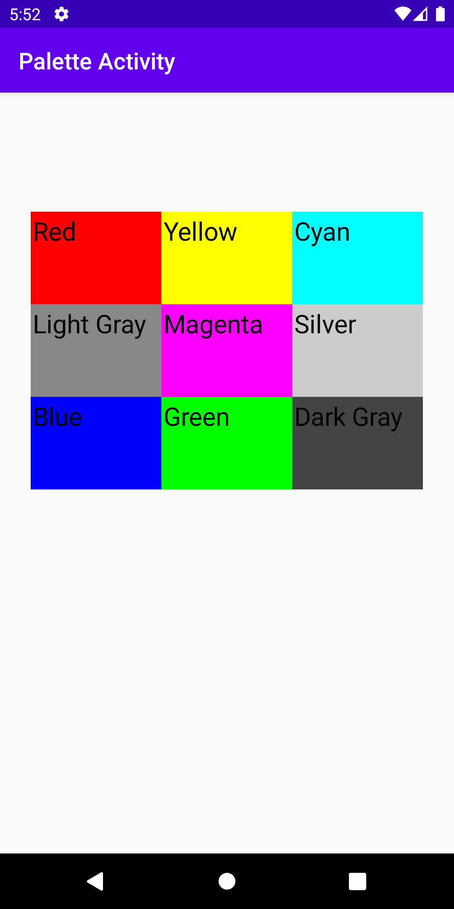

# Assignment 04 Color Changing App
Instructions: 
Create an application containing 2 activities along with a custom adapter. Your application will allow a user to select a color from a Spinner on one activity, and once selected, launch the second activity and set the background of the new activity’s layout to the selected color. Once completed, you will add an icon to your application and generate a signed APK that is ready to be distributed.
# Application Function
The app icon of color changing app looks like this

Once the user get into the application, the app presents a grid view with three columns, which looks like this

Once the user click the item of the grid view, the application will start another activity and set the background color as the user clicked.

